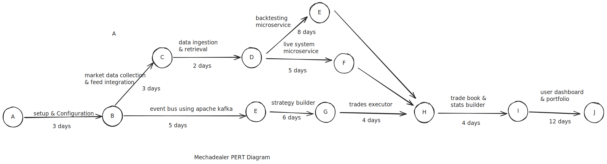

# MechaDealer

## Introduction

Mechadealer is a trading firm that specialises in trade of equity, commodities, future and options using manual trading. The firm wants to now explore the field of automated trading and is looking forward to build an in-house trading system that would allow for the integration of new and advanced trading algorithms.

Their current trading setup makes them miss on certain opportunities, resulting in missed profit. Furthermore, The firm also want to allow its current and potential clients to invest into trading strategies running on this automated system.

## Objectives

1. Build an automatic trading system, that would allow for the integration of new and advanced trading algorithms.
2. Implement a user-friendly interface, so that any user, with minimal knowledge of programming, can use the trading system.
3. Multiple strategies can be employed on automated trading system.
4. The clients will be able to allocate funds to specific strategies, monitor performance, and adjust investments based on real-time data.
5. The clients will be able to view key performance metrics including current balance, unrealised profit, realised profit, and ROI.
6. Security measures should be implemented to protect the client's data and assets.

## Project Category

This project is categorised as a FinTech application, which wants to empower retail investors into automated trading strategies. It encompasses automated trading, algorithmic strategies, client investment platforms, and real-time financial analytics.

## System Analysis

### Identification of Need

The need of an automated trading arises from following factors --

1. Due to manual nature of current trading activity, the firm misses out on utilising strategies that could generate profit.
2. The firm is not able to monitor the performance of its trading strategies on a real-time basis.
3. There is a heavy dependency on human discretion and manual intervention to allocate funds to specific strategies and adjust investments.
4. The firm is not able to make optimal use of its resources, as it is dependent on human intervention.

### Project Planning & Scheduling

The project will be divided into the following phases --

#### PERT (Program Evaluation and Review Technique) Chart

### GANTT Chart

[Chart here]

### Software Engineering Paradigm Applied

The software engineering paradigm applied will be the **Agile methodology**.

### Diagrams and Data Modeling

### Application Architecture

[Conceptual Diagram]

[Logical Diagram]

[Physical Diagram]

#### Data Flow Diagrams (DFD's)

[DFD Level 0]

[DFD Level 1]

[DFD Level 2]

### Control Flow Diagrams

### State / Sequence Diagrams

### Entity Relationship Model (ERD)

### Other possible diagrams

Class Diagrams/CRC Models/Collaboration
Diagrams/Use-case Diagrams/Activity Diagrams and Sequence Diagrams
